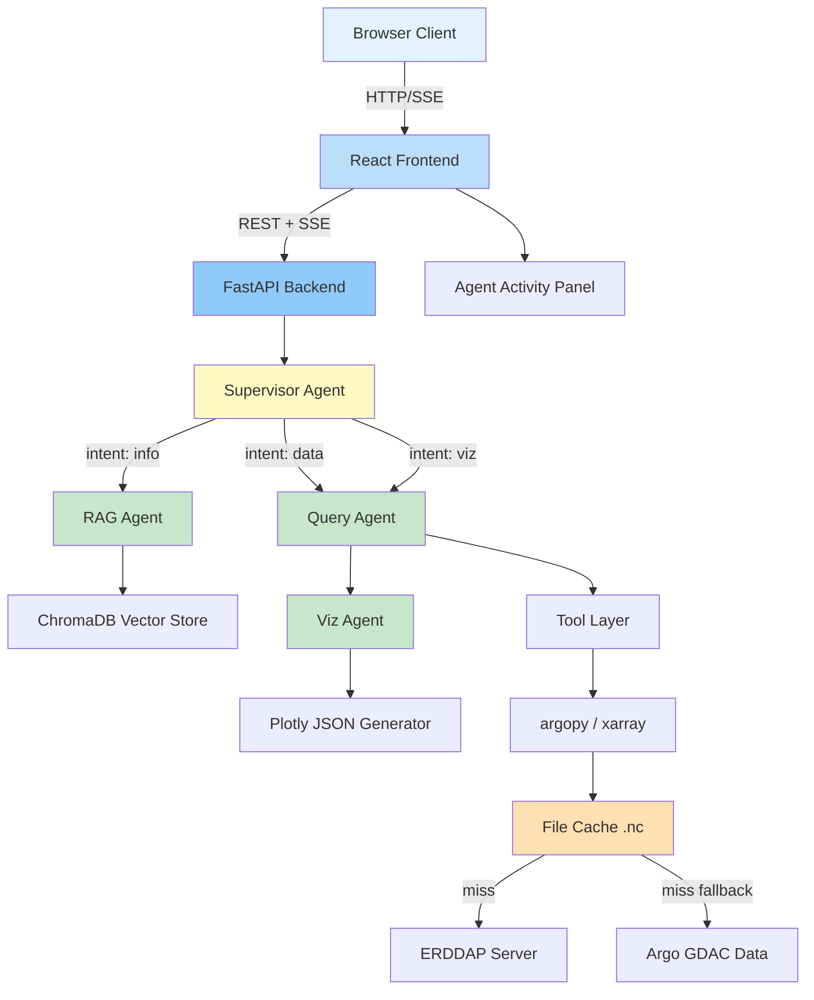

# AquaQuery Architecture

## System Overview

AquaQuery is a natural language chatbot for querying Argo oceanographic data.
Users ask questions in plain English, and the system routes queries through
specialized AI agents to fetch data, compute statistics, and generate visualizations.

## System Diagram

## Data Flow

1. User types a natural language query in the chat interface
2. Frontend sends query via POST /chat/message (or SSE /chat/stream)
3. Supervisor agent classifies intent (info, data, visualization)
4. Appropriate agent(s) execute:
   - **RAG Agent**: Retrieves context from ChromaDB, generates answer
   - **Query Agent**: Translates to tool calls, fetches/filters Argo data
   - **Viz Agent**: Takes query results, generates Plotly JSON
5. Response streams back to frontend via SSE
6. Frontend renders text, charts (Plotly.js), and maps (Leaflet)

## Component Overview

### Frontend (React + TypeScript + Vite)
- Chat interface with message history
- Plotly.js chart rendering from backend JSON
- Leaflet map for geographic data display
- SSE client for streaming responses
- shadcn/ui component library + Tailwind CSS

### Backend (FastAPI + Python)
- REST + SSE API endpoints
- LangGraph state machine for agent orchestration
- Tool layer wrapping argopy data access
- ChromaDB vector store for RAG
- In-memory session storage

### Data Layer
- **ArgoDataManager**: ERDDAP-first data fetching with file-based NetCDF caching
- **argopy**: Fetches Argo float data (ERDDAP primary, GDAC fallback)
- **xarray**: N-dimensional array operations on NetCDF data
- **ChromaDB**: Vector store for oceanographic knowledge base
- **sentence-transformers**: Local embeddings (all-MiniLM-L6-v2)

### ArgoDataManager
The `ArgoDataManager` class replaces direct `ArgoDataLoader.fetch_region()` calls
for data queries. It uses ERDDAP as the primary source (faster, more reliable) with
GDAC as fallback. Results are cached as `.nc` files in `data/cache/` using MD5 hash
keys derived from query parameters. Cache hit performance: <1s vs 10-60s for fresh fetches.

## Tech Stack Rationale

| Choice | Why |
|--------|-----|
| FastAPI | Async-native, automatic OpenAPI docs, SSE support |
| LangGraph | Stateful agent orchestration with conditional routing |
| Claude Sonnet | Best coding/reasoning model, native tool calling |
| argopy | Purpose-built Argo data library with caching |
| ChromaDB | Embedded vector store, no server needed |
| sentence-transformers | Free local embeddings, no API key required |
| SSE over WebSocket | Simpler, HTTP-based, sufficient for request-response streaming |
| Plotly.js | Rich interactive charts, JSON-serializable figures |
| Leaflet | Lightweight mapping, good for ocean data |
| React + Vite | Fast dev experience, TypeScript support |

## Scalability Path

The `DataSource` abstract base class allows future datasets:
- Climate reanalysis (ERA5)
- Satellite ocean color
- Seismic event catalogs
- Weather station data

Each new dataset implements the same interface, plugging into existing agent infrastructure.
